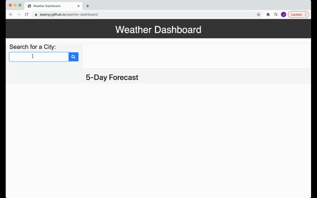

# weather-dashboard

 

## Table of Contents
||||
|:-:|:-:|:-:|
|[Table Contents](#table-of-contents)|[Deployed Link](#deployed-link)|[Technologies Used](#technologies-used)
|[Description](#description)|[Work Involved](#work-involved)|[Code Snippet](#code-snippet)
|[License](#license)|[Authors](#authors)|[Acknowledgments](#acknowledgments)

## Site Gif


## Technologies Used
|||||
|:-:|:-:|:-:|:-:|
|Weather API		|Moment.js			|jQuery	|Javascript
|HTML	|CSS	|Bootstrap	|Github
---

## Description
This application utilizes third-party APIs in order to retrieve
weather data for cities. When you search for a city within the search bar, current and future weather conditions are displayed, as well as the city name, the date, icon representation of weather conditions, the temperature, the humidity, the wind speed, and the UV index. The UV index is also color coordinated to indicate whether the conditions are favorable or unfavorable. A 5-day forecast is also displayed.

## Deployed Link
[Deployed Link](https://jessnyj.github.io/weather-dashboard/)

## Work Involved
For this application, I incorporated third party APIs in order to retrive weather information about cities and for the UV index. I developed search field, the 5day forecast, and the remainder of the website utilizing CSS, Bootstrap, and HTML.

 ## Code Snippet
 ```
    <div id="searchbar" class="col-3 bg-light">
                <h2 id="searchCity">Search for a City:</h2>
                <div class="input-group mb-3">
                    <input type="text" class="form-control" id="searchinput" type="search" aria-label="Search"
                        class="user-search">
                    <div class="text-append">
                        <button id="searchBtn" type="button" class="btn btn-primary"><i class="fas fa-search"></i></button>
                    </div>
                </div>
            </div>
```

## Authors
**UC Berkeley Coding Bootcamp**

**Jessny Joseph** 

[Github](https://github.com/jessnyj) | [LinkedIn](https://www.linkedin.com/in/jessny-joseph-361515201)

## Acknowledgments
I would like to thank the mentors and colleagues who helped inspire and improve upon this project.
